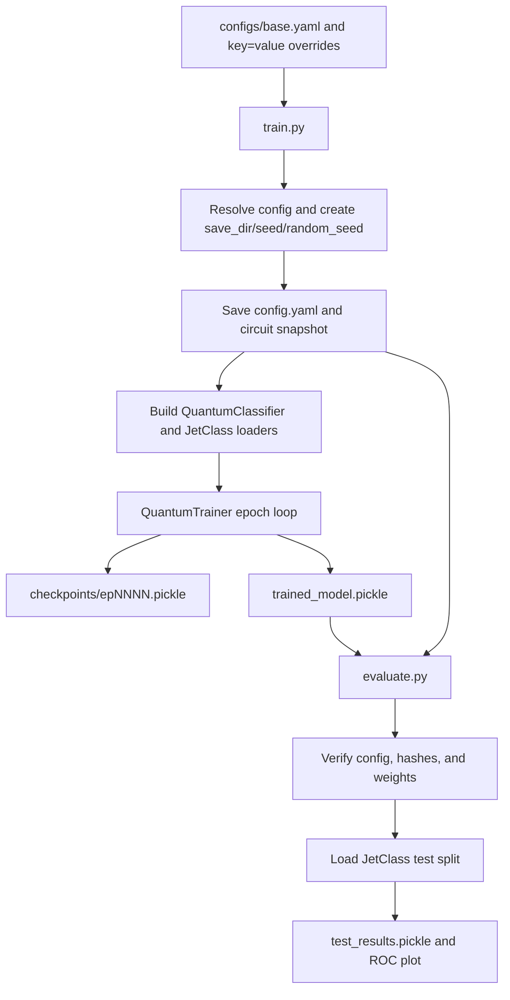

# Repository guide for future agents

This document describes the repository as it exists on 2026-09-11. Read `AGENTS.md`
first for local operating rules. The original JetClass workflow uses `train.py`,
`run_experiments.py`, and `evaluate.py`. The JetClass/JetGame same-particle
reuploading study uses `run_depth_readout.py`; its input and optimizer contracts
are deliberately separate from the original workflow.

The original workflow's base data paths and hard-coded W&B entity/project are
site-specific; confirm them before launching `train.py`. W&B online use requires
credentials. Publishing uses an explicitly supplied `--output-dir`, never an
assumed public path. The depth/readout runner does not use W&B or publishing.

## Current scope

The original training/evaluation path supports:

- JetClass signal versus background classification.
- The `normal` variational quantum classifier registered in `quantum/circuits/registry.py`.
- JAX with Optax/Adam (recommended, GPU-accelerated -- see [JAX backend (recommended)](#jax-backend-recommended)), or PennyLane Autograd with Adam (fallback, required for finite-shot execution).
- MSE or binary cross entropy with logits.
- Training, epoch checkpoints, resumption, final model certification, and evaluation.
- Reproducible random-seed runs and bounded parallel launch of repeated training.

The depth/readout study additionally supports cached JetClass and JetGame Top/QCD
features, same-particle reuploading through depth 128, Z0/all-Z/all-Z+ZZ readouts,
PennyLane default.qubit with Torch or JAX backprop, AdamW, five-seed statistics, and two
independent shards per dataset. See [Depth/readout study](#depthreadout-study).

There is no active QAE, VPC, AOJ, probabilistic-output, or private Delphes workflow. Some tracked research utilities still refer to those older workflows; they are listed under [Peripheral and legacy files](#peripheral-and-legacy-files).

## Environment and common commands

`AGENTS.md` requests `pennylane-gpu-sep2026` for local work. Upstream documents
`pennylane-gpu-jax-sep2026` for its JAX stack (Python 3.14.7, PennyLane 0.45.1,
Lightning 0.45.0, JAX 0.10.2, Optax 0.2.8). Neither named environment is present
in the checked local Conda installations. No environment or dependencies were
created/changed for this work. The existing ParT interpreter permits limited
CPU compatibility checks (PennyLane 0.42.3, Torch 2.9.1, JAX 0.6.2, Optax 0.2.5,
OmegaConf 2.3.1), not validation of the intended GPU stack. On the machine with
the upstream JAX environment, use:

```bash
conda run -n pennylane-gpu-jax-sep2026 python --version
conda run -n pennylane-gpu-jax-sep2026 python -m unittest discover -s tests -q
```

`requirements.txt` pins the exact versions needed to reproduce `pennylane-gpu-jax-sep2026` (jax is sensitive to version drift; see below) and is the recommended way to build a new environment. The default simulator is `default.qubit` with `diff_method: 'backprop'` (both configurable in `configs/base.yaml`; see below and `configs/README.md`). `QuantumClassifier.set_circuit()`'s `diff_method` argument is validated at QNode construction time -- an incompatible device/diff_method/shots combination (e.g. `backprop` with `lightning.qubit` or with finite shots) raises a `ValueError` naming the conflict and suggesting `parameter-shift`, instead of PennyLane's raw traceback. `QuantumClassifier.from_config()` falls back to PennyLane's own default (`'best'`) when a saved config predates the `diff_method` field, reproducing historical behaviour for old runs rather than forcing `backprop` on them.

Training initializes Weights & Biases even when no online account is wanted. Set offline mode for local work:

```bash
WANDB_MODE=offline conda run -n pennylane-gpu-jax-sep2026 \
  python train.py seed=run_001 random_seed=42 data_dir=/path/to/JetClass
```

Inspect the merged configuration without starting training:

```bash
conda run -n pennylane-gpu-jax-sep2026 python train.py --print-config
```

`configs/base.yaml`'s literal default is `backend: 'jax'`; pass `backend=autograd` explicitly for the CPU fallback, e.g. for finite-shot runs.

## JAX backend (recommended)

`backend: 'jax'` is a PennyLane QNode `interface` value, GPU-accelerated via `jax.jit` and `optax.adam`; it is `configs/base.yaml`'s default and the recommended backend for new runs on GPU hardware. `backend: 'autograd'` is the CPU fallback and is required whenever finite-shot execution (`shots>0`) is needed, since jax has no finite-shot path.

- `jax==0.10.2` is pinned in `requirements.txt` -- PennyLane 0.45.1's jax interface depends on a `jax.core` API removed in JAX 0.11; a later `jax` silently breaks `adjoint`/`parameter-shift`/`jax.jit` while plain `backprop` still appears to work.
- Analytic execution only (`shots<=0`); `set_circuit()` raises `ValueError` for `backend='jax'` with `shots>0`.
- `QuantumClassifier.__init__` enables `jax.config.update("jax_enable_x64", True)` once, as its first action, only when `backend='jax'` -- JAX defaults to float32 otherwise, silently diverging from the autograd path's float64 baseline.
- Training uses `optax.inject_hyperparams(optax.adam)` instead of `qml.AdamOptimizer`, with its own checkpoint schema (`optimizer.name == 'optax_adam'`, `optimizer.opt_state` numpy-converted for portable pickling) validated by a separate function in `helpers/trained_run.py`. Learning-rate decay mutates `opt_state`'s injected `learning_rate` field directly (no optimizer reconstruction, no jit recompile).
- `QuantumTrainer._jax_train_step` is a single `jax.jit`-compiled Adam step, built once per trainer (not per call, so jit's compilation cache applies) and retraced at most twice per run (regular batch shape, smaller final partial batch).
- `QuantumTrainer.current_weights` (read by validation, checkpointing, and final certification regardless of backend) is written back from the jax-native `jax_params` on every training call inside `iteration()` -- this sync is load-bearing; without it, training looks normal while validation/checkpoints/the certified model silently keep the untrained initial weights.
- `run_experiments.py` sets `XLA_PYTHON_CLIENT_PREALLOCATE=false` in a jax-backend child's environment (JAX's default eager GPU memory preallocation can OOM a second concurrent jax subprocess on a shared GPU otherwise), and pins each child to one GPU via `--gpu-id`/`CUDA_VISIBLE_DEVICES` (see [Configuration behavior](#configuration-behavior)).
- `jax[cuda12_local]` (the `requirements.txt` extra) assumes a system CUDA 12.x toolkit already on `LD_LIBRARY_PATH`; on a machine where pip's own CUDA wheels conflict with it (silent CPU fallback -- `jax.devices()` reports no `CudaDevice`), see the troubleshooting comment above `jax[cuda12_local]` in `requirements.txt` for the manual `pip uninstall` fix.
- Not implemented: finite-shot (`shots>0`) execution under `backend='jax'`.

## Maintained source map

| File | Responsibility |
| --- | --- |
| `train.py` | Training entry point. Resolves configuration, creates the run, snapshots the circuit, builds loaders and the model, trains, checkpoints, and writes final artifacts. |
| `run_experiments.py` | Repeated-run launcher. Freezes one resolved input configuration and starts runs with independently generated random seeds under bounded process parallelism. |
| `evaluate.py` | Evaluation entry point. Evaluates one certified run or evaluates and aggregates every random-seed run beneath an experiment directory. |
| `publish_reports.py` | Builds the static interactive report site from saved validation histories, configurations, and evaluation results. |
| `configs/base.yaml` | Single default configuration for the JetClass VQC. |
| `configs/README.md` | Detailed description of configuration fields and command line overrides. |
| `case_reader.py` | JetClass HDF5 loading, fixed feature scaling, class balancing, deterministic shuffling, and internal batching. |
| `quantum/architectures.py` | `QuantumClassifier`, QNode construction, inference, `QuantumTrainer`, the epoch loop, and checkpoint writing. |
| `quantum/circuits/base.py` | Circuit protocol, default layer loop, rotation-shape contract, and `CircuitWeights`. |
| `quantum/circuits/vqc.py` | Encoding, CNOT ring, trainable rotations, and measurement for the maintained VQC. |
| `quantum/circuits/registry.py` | Maps the config value `normal` to `VQCCircuit`. |
| `quantum/losses.py` | Connects circuit scores to the registered MSE and BCE losses. |
| `quantum/math_functions.py` | Small differentiable MSE and stable BCE-with-logits implementations. |
| `helpers/config.py` | OmegaConf loading, CLI parsing, config saving, and evaluation config lookup. |
| `helpers/trained_run.py` | Circuit snapshots, fingerprints, checkpoint validation, final model validation, and saved-run reconstruction. |
| `helpers/utils.py` | Feature index constants, `sigmoid()`, and general pickle helpers still used by training and evaluation. |
| `report_site/` | Static frontend (`index.html`, `assets/app.js`, `assets/styles.css`) rendered by `publish_reports.py`'s output; dark theme by default. |
| `tests/` | Unit, integration, checkpoint, reconstruction, data-loader, and report-publication tests. |

## Depth/readout study

`configs/depth_readout.yaml` and `configs/DEPTH_READOUT.md` define the separate
study. `run_depth_readout.py --jax` merges `configs/depth_readout_jax.yaml`,
selecting `circuit.interface=jax`, `training.jax_device=gpu:0` and a separate
`saved_models/depth_readout_jax` output tree. Without `--jax`, the original Torch
defaults remain. Only the selected interface's device field is accepted, not
two conflicting device settings. The runner freezes configuration and launches one isolated
worker per run, sequentially within a shard. `helpers/depth_config.py` validates
the protocol and partitions jobs by summed depth. There are 13 depths
`[1,2,3,5,8,12,16,24,32,48,64,96,128]`, three readouts, five fixed seeds, two
datasets: 390 runs. Two shards per dataset can run concurrently on two 48 GB
GPUs, two workers per GPU selected using `CUDA_VISIBLE_DEVICES`.

`helpers/feature_cache.py` reads existing complete `polarization.1p1q-features`
HDF5 caches; there is no runtime dependency on the polarization checkout. Base
angles have shape `(events, wires, 2)` and contain `(pt_fraction*deta,
pt_fraction*wrapped_dphi)`. Each seed selects 200000 training events, with full
JetClass validation (1M) or 100000 JetGame validation events. Exact canonical
Top/QCD subset RNG and row ordering match polarization. Bounded HDF5 reads avoid
its entire-dataset materialization. Immutable per-seed memory-mapped subsets are
built once under locks, with cache identity and selected feature/row/label/ID
hashes. JetClass IDs are synthetic split/row identifiers, not content hashes.

`quantum/circuits/reupload.py` reuses CircuitBase/VQCCircuit's ordered layer loop,
CNOT ring and rotations; every layer encodes the SAME particles via RY then RX,
scaled by `3.926990817 * (1 + 2*pi*sigmoid(deformation))`. No successive-particle
offset is used. `qml.probs` on default.qubit/Torch-or-JAX/backprop/shots=None supplies
one final computational-basis distribution. Classical parity signs compute
`<Z0>`, `sum a_i<Zi>`, or `sum a_i<Zi> + sum_(i<j) b_ij<ZiZj>` and add bias.
All 45 pairs are included for ten wires. Readout coefficients initialize to Z0;
rotations/deformation use polarization's seeded Torch U(0,pi) stream, bias=0.
There is no native quantum simulator. Internal precision may be promoted by
PennyLane; actual probability dtype is recorded, not asserted to be float32.

`helpers/depth_study.py` owns one shared lifecycle for both numerical backends.
Torch uses its AdamW; `helpers/depth_jax.py` uses Optax AdamW with the same betas,
epsilon, masked decay and dynamic epoch LR. JAX JIT compiles training and batched
prediction once per worker/session; compilation is separately timed and reported.
Fixed-size zero padding with explicit loss masks retains every partial batch
without retracing. `lax.scan` sums weighted microbatch gradients before one
optimizer update. A second `lax.scan` loops over the shared PennyLane layer to
avoid an enormous depth-unrolled XLA graph. PennyLane prepares |0>, executes
each layer, and computes final probabilities; `qml.StatePrep` passes the full
analytic state between layers without normalization, reset, measurement or
gradient stopping. There is no native simulator. Values/gradients are checked
against the full, unrolled Torch QNode. JAX x64 is enabled for promoted state precision and
matmul precision is highest; configured input/parameter/readout dtype is retained.
Torch CPU supplies the same initialization and epoch-shuffle RNG streams on both
paths. GPU selection is explicit and fails if unavailable; XLA preallocation is
disabled by default before JAX import for GPU sharing. JAX memory statistics are
allocator high-water marks where supported, otherwise null, not Torch readings.

Both use AdamW with decay only on classical parameters,
25 epochs, 5-epoch linear warmup (0.001→0.005), cosine decay to 0.001, BCE logits.
The optimizer batch is 1024; configurable microbatches default to 64 for the
two-48-GB-GPU deployment, with sample-weighted gradient accumulation. This
microbatch has not been CUDA-profiled locally. A seed controls initialization,
data subset selection and epoch shuffles; five-seed spread is not exclusively
initialization uncertainty. No early stopping; best model selection uses
validation AUC, with minimum validation BCE separately reported. Test data are
not accessed by this scan.

Runs live at `<output_dir>/<dataset>/L<depth>/<readout>/<seed>/`. Each saves source
snapshots, config/data hashes, dependency/hardware/session metadata, initial
metrics, per-epoch CSV/JSON history, AdamW epoch checkpoint, best/final weights,
validation predictions/identities and completion-marked results.json. Resume
rejects changed config, source, selected data or dependency versions. Initial
and final fixed-weight train BCE are evaluated to measure comparable BCE drops;
epoch online train BCE is separately labelled. CUDA times are synchronized and
training, validation, metric calculation, data load and JIT compilation times are
distinguished. JAX checkpoints retain NumPy-converted parameter/Optax trees in
the same `.pt` container format, with shape/dtype validation on restore. Torch
and JAX artifacts are not interchangeable; neither are pre-port source snapshots
accepted for continuation under changed code. Keep old result trees intact.

`helpers/depth_metrics.py` records BCE, ROC AUC/AP, accuracy/balanced accuracy,
Brier score, confusion counts, operating-point thresholds/efficiencies/rejection,
score distributions, timing/throughput/memory and nominal parameter counts.
Zero accepted background gives null rejection. Nominal parameter counts include
the known Z0 final-layer non-readout rotations (27 at ten wires) with zero
influence. The reporting layer provides per-run CSV, mean/sample-SD/SEM/Student-t
interval tables, paired within-seed differences versus Z0, explicit missing-seed
coverage, and PNG/PDF depth plots. Each completed launcher refreshes the combined
report under a lock. Validation selection and five seeds do not establish
unbiased held-out test performance or convergence.

The remainder of this document describes the original `train.py` workflow
unless specifically qualified.

The repository uses namespace packages and has no tracked `__init__.py` files under `helpers/` or `quantum/`. Run commands from the repository root so those imports resolve naturally.

## End-to-end control flow



## Data contract and preprocessing

Training and evaluation locate files with this layout:

```text
<data_dir>/
├── train/<sample>/*.h5
├── val/<sample>/*.h5
└── test/<sample>/*.h5
```

When `flat=true`, the split names are `flat_train`, `flat_val`, and `flat_test`. The default signal is `TTBar_` with label 1, and the default background is `ZJetsToNuNu` with label 0.

Each HDF5 file must contain:

- `jetConstituentsList`, normally shaped `(N, 100, 3)`. The last axis is `(eta, phi, pt)`.
- `jetFeatures`. Column 0 is used as the jet transverse momentum.

`CASEJetClassDataset` performs the following work when it is constructed:

1. Sorts the signal and background file lists.
2. Reads only the leading rows still needed to reach each requested class count.
3. Verifies that particle transverse momenta are in descending order for every loaded jet.
4. Keeps the leading `num_particles` constituents.
5. Scales the features.
6. Concatenates signal and background and shuffles them with NumPy RNG seed 0 unless a different loader seed is passed directly.
7. Materializes the selected data in memory and yields internal batches through a PyTorch `DataLoader` with `batch_size=None`.

The config `seed` names an experiment and does not control randomness. `random_seed` controls model initialization, each split's deterministic loader permutation, and PennyLane finite-shot sampling. The maintained loader uses an explicit local NumPy generator and does not rely on the global NumPy RNG.

With `norm_pt=false`, fixed assumed ranges are mapped to the circuit ranges:

- pt: `[1e-4, 3000]` to `[0, 1)`.
- eta and phi: `[-0.8, 0.8]` to approximately `[-pi, pi)`.

Values are scaled but not clipped. With `norm_pt=true`, constituent pt is divided by jet pt while eta and phi still use fixed scaling.

The circuit needs `wires * num_layers` particles because every layer encodes a new group of particles. `num_particles` is an optional OmegaConf override. It defaults to that product and cannot be smaller.

Training and validation use the configured `batch_size`. Evaluation omits that argument and therefore uses the loader default of 32, but `run_inference()` deliberately scores each jet individually.

## Configuration behavior

`helpers.config.DEFAULT_CONFIG` points to `configs/base.yaml`. `load_config()` loads that YAML, merges any OmegaConf dotlist arguments, resolves interpolation, and returns a `DictConfig`.

Examples:

```bash
python train.py seed=run_002 random_seed=42 epochs=40 flat=true
python train.py aux_weights.bias=0.0 num_particles=12
python train.py --config /path/to/another.yaml seed=run_003
```

OmegaConf accepts new entries as well as overrides. Every resolved entry is written to the run's `config.yaml`, including new keys and interpolated values. A new run converts `save_dir`, `data_dir`, and `dump` to absolute paths before saving.

The authoritative field reference is `configs/README.md`. The settings that define the circuit are `wires`, `num_layers`, `shots`, `device_name`, `backend`, `circuit_type`, `operations_per_qubit`, and `aux_weights`. `random_seed` is part of each training run. `--number-of-runs`, `--num-processes`, and `--gpu-id` belong only to `run_experiments.py` and are never saved in a model configuration.

Launch repeated runs with:

```bash
python run_experiments.py --config configs/base.yaml \
  --number-of-runs 10 --num-processes 4 --gpu-id 0,1 \
  seed=experiment_001
```

This launches 10 runs, each with its own random seed generated by NumPy's default RNG, and keeps at most four training subprocesses active at once. `--num-processes` and `--gpu-id` are independent: `--num-processes` alone bounds concurrency (as many CPU-bound one-thread subprocesses as requested for `backend='autograd'`); for `backend='jax'`, `--gpu-id` (default `0`) additionally restricts each launched process to exactly one GPU from the list, assigned round-robin via `CUDA_VISIBLE_DEVICES` -- without it, every jax process registers a small memory footprint on every visible GPU at startup regardless of which one it actually computes on. If `--num-processes` exceeds the number of listed GPUs, multiple processes share a GPU's compute (verified safe, just slower per run than a dedicated GPU); `--gpu-id` has no effect for `backend='autograd'`, which has no GPU-accelerated code path in this pipeline. A `random_seed=` override on the launcher's own CLI is rejected; that field is only meaningful when calling `train.py` directly. The launcher rejects resume mode, freezes the resolved input in a temporary YAML for the duration of the launch, and stops scheduling new work after a child failure.

Evaluation has a separate parser. It accepts exactly one source:

```bash
python evaluate.py --config /models/run_001/42/config.yaml
python evaluate.py --seed run_001 --random-seed 42 --model-dir /models
python evaluate.py --experiment-dir /models/run_001 --num-cores 4
```

It rejects training overrides and ambiguous sources. When `--model-dir` is omitted, single-run seed lookup uses `save_dir` from the current base config. `--num-cores` is valid only with `--experiment-dir` and is not a saved configuration field. Evaluation reruns whichever `backend` the loaded run was trained with; it is not a separate choice.

Publish every numeric experiment as a static interactive report with:

```bash
python publish_reports.py --models-dir saved_models --results-dir results \
  --output-dir /path/to/public/interactive/1P1Q
```

The publisher copies the frontend in `report_site/`, writes one JSON document per experiment,
and replaces the experiment index last. Published data includes aggregate and individual
validation AUC and ROC curves, and per-run classifier score distributions (a 30-bin
signal/background density histogram, shown per seed only -- there is no aggregate view), but
excludes raw event scores, labels, and local filesystem paths. The frontend (`report_site/assets/`)
uses a dark theme by default (`color-scheme: dark`, no light/dark toggle).

## Circuit and score construction

`QuantumClassifier.from_config()` validates the required circuit fields, creates the PennyLane device, and asks the registry for the selected circuit. Shots greater than zero produce finite-shot execution. Nonpositive shots select analytic execution, which is the base default.

`CircuitBase.build()` defines the common circuit order for every layer:

1. `encode()`
2. `entangle()`
3. `rotate()`

It calls `measure()` after the final layer. `measure_override` is retained as an extension point for a different terminal measurement.

For the maintained `VQCCircuit`:

- Layer `l` and wire `w` consume particle `w + l * n_wires`.
- Encoding applies `RY(scale * pt * eta)` and `RX(scale * pt * phi)`.
- The trainable scale is `2 * pi * sigmoid(aux_weights.scale_factor) + 1`.
- Entanglement is a CNOT ring from each wire to the next, with the last wire connected to wire 0.
- Trainable gates are `Rot(0, ry, rz)` followed by `RX(rx)` on each wire.
- Measurement is the expectation value of a Hamiltonian containing one Pauli Z term per wire. Each wire's coefficient is independently trainable, all starting from `aux_weights.hamiltonian_coeffs` (default 0.1). This requires a differentiation method that supports Hamiltonian/observable coefficients: PennyLane's adjoint method (the default `best` resolution for `lightning.qubit`) cannot differentiate them and silently returns a zero gradient, freezing `hamiltonian_coeffs` at its initial value while `rot`/`scale_factor`/`bias` still train normally. `backprop` (the current default, paired with `default.qubit`) and `parameter-shift` (works on any device/shot count, including `lightning.qubit`, at the cost of roughly two circuit evaluations per differentiable parameter per step) both differentiate `hamiltonian_coeffs` correctly -- verified directly for both. `adjoint` is the only common option that silently fails for this parameter.

`CircuitWeights` separates parameters into:

- `rot`, normally shaped `(num_layers, wires, operations_per_qubit)`.
- `aux`, a mapping of named trainable values. The default VQC uses `scale_factor` and `bias` (both scalars) and `hamiltonian_coeffs` (one independent value per wire, broadcast from a single starting scalar by `helpers.trained_run.resolve_aux_weights()`).

The default `operations_per_qubit` is 3 and matches the RZ, RY, and RX parameters consumed by `VQCCircuit.rotate()`.

`VQC_cost()` adds the trainable bias to the Hamiltonian expectation. That value is the classifier score. MSE compares the raw score with the label. BCE treats the score as a logit and uses the stable expression `logaddexp(0, logit) - label * logit`. The maintained pipeline does not convert scores to probabilities. `VQC_cost()`, `mean_squared_error()`, and `binary_cross_entropy_with_logits()` use `qml.math` instead of `pennylane.numpy` directly (except for one explicit interface branch each, in `binary_cross_entropy_with_logits()`'s `logaddexp` and `VQCCircuit.sigmoid()`'s `exp` -- `qml.math`'s own dispatch for those two ops is unreliable under both interfaces in this PennyLane version), so the same loss/circuit code runs under both `backend` values.

## Training flow

`train.py` performs these steps for a new run:

1. Fully resolves the incoming OmegaConf config, converts `seed` to a string, and validates the integer `random_seed`.
2. Selects `<save_dir>/<seed>/<random_seed>` as the run directory and claims it atomically to prevent accidental overwrite.
3. Creates the run and plot directories, initializes the `neo1P1Q` Weights & Biases project without local path settings, and starts Loguru file logging.
4. Saves the exact resolved config to `config.yaml`.
5. Copies `base.py`, `registry.py`, and `vqc.py` into the run's `circuits/` directory.
6. Imports that saved registry and calculates SHA-256 hashes for the saved circuit files.
7. Builds the classifier from the saved circuit implementation.
8. Initializes the rotation tensor uniformly on `[0, pi)` with a local generator seeded by `random_seed`, then initializes named auxiliary weights from the circuit defaults plus config overrides.
9. Finds the configured JetClass signal and background files for training and validation.
10. Builds balanced loaders and an Adam optimizer.
11. Creates `QuantumTrainer`, passing it the resolved config and circuit hashes for checkpoints.
12. Runs an initial validation pass at epoch 0, followed by training epochs 1 through `epochs`.
13. Writes a checkpoint after every completed validation pass when `save=true`.
14. Certifies and writes `trained_model.pickle` only after the training loop returns successfully.
15. Writes history and a history plot in the `finally` block and closes the Weights & Biases run.

Losses are averaged by sample count, so a smaller final batch receives the correct weight. Validation history and AUC include epoch 0; training history starts at epoch 1.

Each validation pass also logs a signal-vs-background classifier score histogram to Weights & Biases under the fixed key `score_distribution`, so the run page always shows only the latest epoch's distribution. For BCE runs the plotted values are `helpers.utils.sigmoid(score)` (probabilities), since BCE scores are logits; MSE runs plot the raw score. `evaluate.py`'s per-run `score_distribution.png` and the interactive site's per-run score-distribution chart apply the same conversion (AUC/ROC are unaffected, since sigmoid is monotonic).

After `min_epochs` training epochs, insufficient recent validation AUC improvement multiplies the Adam step size by `decay_rate`. Training stops only when another insufficient-improvement check occurs after `decay_patience` reductions.

A keyboard interrupt during the training loop writes `aborted_weights.pickle`, enters the normal cleanup block, and then exits unsuccessfully. It does not create a certified `trained_model.pickle`.

The optional `evictable=true` override activates legacy EOS checkpoint copying and expects `EOS_MGM_URL`, `CERN_USERNAME`, and `BELLE2_EXEC`. This option is absent from the base config and is outside the maintained local workflow.

## Run directory and persistence formats

A saved run has this structure:

```text
<save_dir>/<seed>/<random_seed>/
├── config.yaml
├── circuits/
│   ├── base.py
│   ├── registry.py
│   └── vqc.py
├── checkpoints/
│   ├── ep0000.pickle
│   ├── ep0001.pickle
│   └── ...
├── trained_model.pickle
├── history.pickle
├── history.png
├── logs.log
├── eval.log
├── wandb_run_id.txt
└── plots/roc_curve.png
```

Some files appear only after the corresponding stage runs. `trained_model.pickle` requires successful training; `eval.log` and the ROC plot require evaluation.

Each epoch checkpoint contains:

```text
weights:
  CircuitWeights(rot, aux)
optimizer:
  name, stepsize, beta1, beta2, eps, accumulation
training:
  config, implementation, completed_epoch, history, n_decays
```

`implementation` is a mapping from each saved circuit filename to its SHA-256 digest. Checkpoints are written to a temporary file and atomically renamed.

The final `trained_model.pickle` contains the weights and a smaller `training` record with the resolved config, circuit hashes, completed epoch count, and stop reason. It does not contain the optimizer state; resumption uses epoch checkpoints.

Pickles are Python-specific and can execute code when loaded. Treat saved run files as trusted local artifacts.

## Resumption

Resume with the saved config:

```bash
python train.py --config /models/run_001/42/config.yaml --resume
```

The incoming `save_dir`, `seed`, and `random_seed` first locate the run. `train.py` then reloads the run's existing `config.yaml`; other training overrides are discarded. Legacy configurations without `random_seed` retain the historical `<save_dir>/<seed>/` lookup. Training imports the saved circuit, selects the checkpoint with the greatest numeric epoch, and verifies:

- Exact config equality.
- Exact saved-circuit hashes.
- A consistent numeric epoch in the filename and payload.
- History lengths and finite metrics.
- Adam type, hyperparameters, moments, and step counter.
- At least one configured training epoch remains.

The trainer restores weights, Adam accumulation, history, learning-rate decay state, and the next epoch. This is required for a resumed step to match uninterrupted Adam training.

## Evaluation and reproducibility checks

`evaluate.py` starts with `load_trained_run()`:

1. Loads the saved YAML and the adjacent `trained_model.pickle`.
2. Rejects missing final weights instead of substituting an epoch checkpoint.
3. Compares the YAML with the config embedded in the final model.
4. Verifies all three saved circuit files and their hashes.
5. Imports the saved registry under a digest-based temporary package name. The global `quantum.circuits` implementation is not used for circuit construction.
6. Recreates the classifier and checks rotation shape, auxiliary weight names and shapes, and finite values.
7. Installs non-trainable copies of the saved weights on the model.

The loader then reads the saved test split and class counts using the saved random seed. Inference produces one loss, raw score, and label per jet. Evaluation computes ROC AUC and writes:

- `<dump>/<seed>/<random_seed>/test_results.pickle`, containing `costs`, `scores`, `labels`, and `auc`.
- `<save_dir>/<seed>/<random_seed>/plots/roc_curve.png`.
- `<save_dir>/<seed>/<random_seed>/eval.log`.

Experiment-directory evaluation scans immediate numeric subdirectories. A run missing its saved configuration, final model, or circuit snapshot is logged and skipped. Other run failures also do not stop queued evaluations. Each child uses one computational thread and at most `--num-cores` children run simultaneously. Successful ROC curves are interpolated onto a common false-positive-rate grid; their mean and one-standard-deviation band are saved as `<save_dir>/<seed>/roc_curve_summary.png`. `<save_dir>/<seed>/evaluation_summary.log` records skipped runs and the final report. The report includes total, successful, and failed run counts; jet counts; and mean AUC plus or minus the population standard deviation across successful runs.

Loading emits a `RuntimeWarning` because completed epochs and early stopping do not establish convergence. Inspect validation loss and AUC history before treating a model as converged. Clean runs with the same random seed reproduce initialization, data order, and finite-shot sampling when code, data, dependencies, backend, hardware, and thread settings match. Finite-shot resumption does not reproduce an uninterrupted sampling stream because device RNG state is not checkpointed.

The snapshot boundary covers `base.py`, `registry.py`, and `vqc.py`. Data preprocessing, loss code, `QuantumClassifier`, and the Python environment are loaded from the current checkout. Changes to those components can affect evaluation of an old run even when the circuit snapshot is unchanged.

## Tests

Run the complete suite from the repository root:

```bash
MPLCONFIGDIR=/tmp/matplotlib conda run -n pennylane-gpu-jax-sep2026 \
  python -m unittest discover -s tests -q
```

Upstream reported 89 passing tests under `pennylane-gpu-jax-sep2026` on
2026-09-11; that is not a local verification of this merged checkout. This
checkout additionally has Torch/JAX depth-study tests. JAX tests are guarded
when dependencies are missing. Original JetClass integration tests run only
when `/ceph/abal/JetClass/test/TTBar_` and `/ceph/abal/JetClass/test/ZJetsToNuNu`
exist. Current local verification and remaining environment/GPU limits are
recorded in `problems.MD` and `configs/DEPTH_READOUT.md`.

| Test file | Coverage |
| --- | --- |
| `test_bce_logits.py` | BCE value and gradient parity with PyTorch, including gradients through circuit output and bias. |
| `test_circuit_base.py` | Rotation shape bounds, Hamiltonian coefficient length, and circuit registry errors. |
| `test_circuit_parity.py` | VQC wiring parity, a fixed golden expectation value, and `diff_method` validation errors. |
| `test_circuit_weights_checkpoint.py` | Pickle round trip for structured rotation and auxiliary weights. |
| `test_config.py` | Typed and nested OmegaConf overrides, random-seed validation, run paths, resume flag, config printing, and byte-stable save/load. |
| `test_end_to_end.py` | Training, finite-shot reproducibility, sample-weighted partial batches, inference cardinality, checkpoints, Adam resumption, and optional real JetClass loading. |
| `test_evaluate_experiment.py` | Experiment discovery, incomplete-run logging, bounded evaluation parallelism, interruption, thread limits, and aggregate ROC reporting. |
| `test_publish_reports.py` | Report JSON structure, path redaction, and aggregate/per-run plot data (including score-distribution histograms). |
| `test_run_experiments.py` | Launcher configuration ownership, random seed generation, concurrency limits, failure handling, interruption, and child thread limits. |
| `test_saved_run.py` | Saved circuit imports, legacy compatibility, nested paths, config and hash mismatch rejection, final weight validation, checkpoint provenance, CLI restrictions, and mocked training-to-evaluation flow. |
| `test_depth_readout.py` | Explicit Hamiltonian parity, matched cached subsets, Torch training, partial microbatches, resume and reports. |
| `test_depth_jax.py` | Four-shard CLI/overlay, JAX/Torch logits/BCE/gradient and AdamW parity, L=128, device/nonfinite failure, JAX continuation and real subprocess launch/report. |

Warnings about CUDA initialization or Autograd with NumPy 2 may appear in the local environment without failing tests. Investigate new warnings separately from these known dependency warnings.

## Safe extension points and invariants

When changing the maintained pipeline, preserve these relationships:

- Data passed to the circuit has shape `(batch, num_particles, 3)`.
- Labels and scores flatten to one value per jet.
- `operations_per_qubit` must match the parameters consumed by the circuit.
- Every trainable value belongs in `CircuitWeights.rot` or `CircuitWeights.aux`.
- Configs saved in checkpoints and final models must match `config.yaml` exactly.
- Circuit files must not change inside a run directory after training starts.
- Resume checkpoints need full Adam accumulation, not weights alone.
- Evaluation requires certified final weights and must continue to reject intermediate checkpoints.
- Metrics must include every sample in partial final batches.

To add a circuit implementation:

1. Implement the `Circuit` protocol, usually by subclassing `CircuitBase` and defining `encode`, `entangle`, `rotate`, and `measure`.
2. Declare `operations_per_qubit` and `aux_defaults`.
3. Register the config name in `quantum/circuits/registry.py`.
4. Add the new source filename to `helpers.trained_run.CIRCUIT_FILES`; otherwise saved runs cannot import it independently of the checkout.
5. Add wiring, shape, gradient, snapshot, and round-trip tests.
6. Add the new config value to `configs/README.md`.

When changing checkpoint or final-model schemas, update both writer and validator in the same change and test failure cases. When changing preprocessing or scoring, test an existing saved-run path because those files are outside the current circuit snapshot.

## Docker

`docker/Dockerfile` builds a Python 3.14 package environment from `requirements.txt`. It intentionally contains no repository source. Build from the repository root, then mount the checkout at `/workspace`; exact commands are in `docker/README.md`. `requirements.txt` now targets the jax-capable environment (see [JAX backend (recommended)](#jax-backend-recommended)); a GPU-visible container additionally needs a matching CUDA 12.x runtime.

Docker CLI is installed on the current machine, but the current user cannot access `/var/run/docker.sock`. The Dockerfile has received static input and syntax review here, but no local image build has been completed in this workspace.

## Peripheral and legacy files

These files are not called by `train.py` or `evaluate.py`:

- `checkdata.py` uses old `OneP1QDataLoader` arguments and a private absolute path. It does not match the current loader API.
- `helpers/path_setter.py` contains an unused older path mapping.
- `helpers/get_free_gpu_id.py` is an unused NVIDIA selection helper. It imports pandas, which is not a maintained runtime dependency.
- `plotters/plot_hist.py` expects older fidelity and cost arrays from a quantum autoencoder workflow.
- `network_runs/logs.log` is a historical output.

Within maintained modules, `select_subjet_constituents`, the semiclassical loss functions, `batched_VQC_cost`, `QuantumClassifier.load_weights`, and the evictable EOS path are not used by the supported entry points. Do not build new behavior on them without first confirming that the user wants those paths restored.

## Before committing changes

1. Read the relevant implementation and its nearest tests.
2. Keep changes within the maintained JetClass VQC scope unless the user explicitly expands it.
3. Run the smallest relevant test first, then the full suite once.
4. Review `git diff --check`, the complete diff, and `git status --short`.
5. Preserve unrelated user changes and ignored local files.
6. Use one concise, imperative commit per logical change and do not add attribution trailers.
