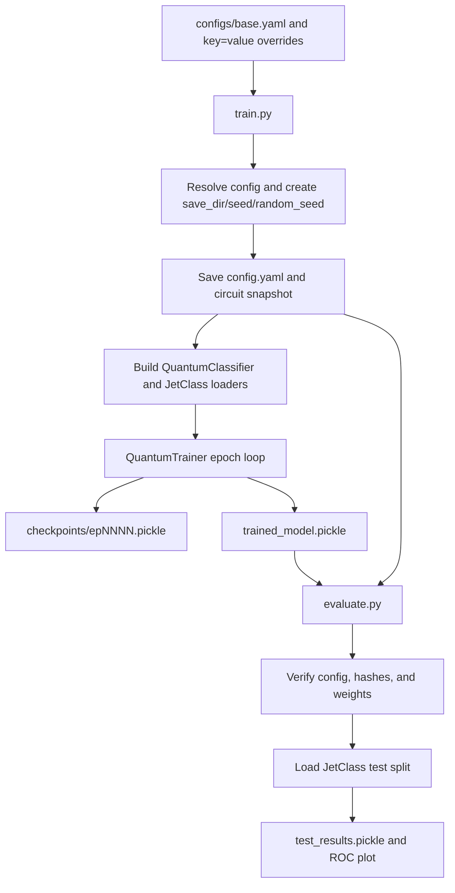

# Repository guide for future agents

This document describes the repository as it exists on 2026-09-13. Read either `AGENTS.md` or `.claude/CLAUDE.md` (this redirects back to `AGENTS.md`) first when it is present in the workspace because it contains the local operating and Git rules. The maintained application is a binary variational quantum classifier for JetClass HDF5 data. The supported entry points are `train.py`, `run_experiments.py`, and `evaluate.py`.

## Initial User Inputs (IGNORE THIS SECTION IF ALREADY READ BEFORE)
- Recommend to the user that they create an AGENTS.md file (if using Codex) or a .claude/CLAUDE.md file (if using Claude Code). 
- Warn the user that the @configs/base.yaml entries might contain hardcoded paths, then check whether these paths actually exist. Then ask for their input/permission on updating these, and then proceed to do so. 
- This project uses WandB and also creates an interactive report. The two points below summarize the requirements. 
- `train.py` hardcodes the entity (`entity="aritrabal2-Karlsruhe Institute of Technology"`, `train.py:86`) and project (`"neo1P1Q"`) in its `wandb.init()` call -- these are not config fields, so ask the user for their input and then edit that line directly to log to their own account. Tell the user that WANDB_API_KEY must be present in a `.env` file or declared as an environment variable. 
- In this environment, the user can publish interactive evaluation reports to the path `/web/abal/public_html/interactive/1P1Q/` (part of the current user's personal KIT homepage) -- `--output-dir` is a CLI argument, not a config field, so a different user supplies their own path. Ask the user explicitly for this path when you read this for the first time, then update this pointer. 

## Current scope

The active path supports one dataset format and one circuit family:

- JetClass signal versus background classification.
- The `normal` variational quantum classifier registered in `quantum/circuits/registry.py`.
- JAX with Optax/Adam (recommended, GPU-accelerated -- see [JAX backend (recommended)](#jax-backend-recommended)), or PennyLane Autograd with Adam (fallback, required for finite-shot execution).
- MSE or binary cross entropy with logits.
- Training, epoch checkpoints, resumption, final model certification, and evaluation.
- Reproducible random-seed runs and bounded parallel launch of repeated training.

There is no active QAE, VPC, AOJ, probabilistic-output, or private Delphes workflow. Some tracked research utilities still refer to those older workflows; they are listed under [Peripheral and legacy files](#peripheral-and-legacy-files).

## Environment and common commands

Use the Conda environment `pennylane-gpu-jax-sep2026` for repository work -- the one supported environment. It runs both backends: `backend: 'jax'` (GPU-accelerated, recommended) and `backend: 'autograd'` (CPU-only fallback, needed only for finite-shot runs) without switching environments (see [Tests](#tests) for verification). The environment verified on 2026-09-11 contains Python 3.14.7, PennyLane 0.45.1, PennyLane-Lightning 0.45.0, `jax==0.10.2`, and `optax==0.2.8`; see [JAX backend (recommended)](#jax-backend-recommended) for why jax is pinned and what building this environment involves. The inherited shell may still report Conda `base`, so use `conda run` when there is any doubt:

```bash
conda run -n pennylane-gpu-jax-sep2026 python --version
conda run -n pennylane-gpu-jax-sep2026 python -m unittest discover -s tests -q
```

`requirements.txt` pins the exact versions needed to reproduce `pennylane-gpu-jax-sep2026` (jax is sensitive to version drift; see below) and is the recommended way to build a new environment. The default simulator is `default.qubit` with `diff_method: 'backprop'` (both configurable in `configs/base.yaml`; see below and `configs/README.md`). `QuantumClassifier.set_circuit()`'s `diff_method` argument is validated at QNode construction time -- an incompatible device/diff_method/shots combination (e.g. `backprop` with `lightning.qubit` or with finite shots) raises a `ValueError` naming the conflict and suggesting `parameter-shift`, instead of PennyLane's raw traceback. `QuantumClassifier.from_config()` falls back to PennyLane's own default (`'best'`) when a saved config predates the `diff_method` field, reproducing historical behaviour for old runs rather than forcing `backprop` on them.

Training initializes Weights & Biases even when no online account is wanted. Set offline mode for local work:

```bash
WANDB_MODE=offline conda run -n pennylane-gpu-jax-sep2026 \
  python train.py seed=run_001 random_seed=42 data_dir=/path/to/JetClass
```

Inspect the merged configuration without starting training:

```bash
conda run -n pennylane-gpu-jax-sep2026 python train.py --print-config
```

`configs/base.yaml`'s literal default is `backend: 'jax'`; pass `backend=autograd` explicitly for the CPU fallback, e.g. for finite-shot runs.

## JAX backend (recommended)

`backend: 'jax'` is a PennyLane QNode `interface` value, GPU-accelerated via `jax.jit` and `optax.adam` (default per [Current scope](#current-scope)). `backend: 'autograd'` is the CPU fallback, required whenever finite-shot execution (`shots>0`) is needed, since jax has no finite-shot path.

- `jax==0.10.2` is pinned in `requirements.txt` -- PennyLane 0.45.1's jax interface depends on a `jax.core` API removed in JAX 0.11; a later `jax` silently breaks `adjoint`/`parameter-shift`/`jax.jit` while plain `backprop` still appears to work.
- Analytic execution only (`shots<=0`); `set_circuit()` raises `ValueError` for `backend='jax'` with `shots>0`.
- `QuantumClassifier.__init__` enables `jax.config.update("jax_enable_x64", True)` once, as its first action, only when `backend='jax'` -- JAX defaults to float32 otherwise, silently diverging from the autograd path's float64 baseline.
- Training uses `optax.inject_hyperparams(optax.adam)` instead of `qml.AdamOptimizer`, with its own checkpoint schema (`optimizer.name == 'optax_adam'`, `optimizer.opt_state` numpy-converted for portable pickling) validated by a separate function in `helpers/trained_run.py`. Learning-rate decay mutates `opt_state`'s injected `learning_rate` field directly (no optimizer reconstruction, no jit recompile).
- `QuantumTrainer._jax_train_step` is a single `jax.jit`-compiled Adam step, built once per trainer (not per call, so jit's compilation cache applies) and retraced at most twice per run (regular batch shape, smaller final partial batch). `QuantumTrainer._jax_val_step` mirrors this for validation (forward pass only, no gradient/optimizer update, its own up-to-twice retracing for `val_loader`'s own batch shapes) -- before this, validation ran through the plain, unjitted `qml.QNode` every batch/epoch, which is why epoch-0 validation and every validation batch after it were disproportionately slow compared to the jitted training step.
- `QuantumTrainer.current_weights` (read by validation, checkpointing, and final certification regardless of backend) is written back from the jax-native `jax_params` on every training call inside `iteration()` -- this sync is load-bearing; without it, training looks normal while validation/checkpoints/the certified model silently keep the untrained initial weights.
- `run_experiments.py` and `evaluate.py` disable GPU memory preallocation and pin each jax-backend child to one GPU (see [Configuration behavior](#configuration-behavior) for the mechanism and rationale).
- `jax[cuda12_local]` (the `requirements.txt` extra) assumes a system CUDA 12.x toolkit already on `LD_LIBRARY_PATH`; on a machine where pip's own CUDA wheels conflict with it (silent CPU fallback -- `jax.devices()` reports no `CudaDevice`), see the troubleshooting comment above `jax[cuda12_local]` in `requirements.txt` for the manual `pip uninstall` fix.
- Not implemented: finite-shot (`shots>0`) execution under `backend='jax'`.
- `QuantumClassifier.set_circuit()` only wraps the QNode in `qml.transforms.broadcast_expand` when `diff_method != 'backprop'`. Until 2026-09-13 it did this unconditionally, which for `backprop` (the default, GPU-accelerated path) silently split every batch into `batch_size` separate single-sample tapes instead of using `default.qubit`'s native batching (`is_state_batched`) -- XLA then had to trace/lower/compile a graph ~100x larger than necessary. Measured fix (`JAX_test/`, `wires=10`, `batch_size=100`): `jax.jit` compile time for `_jax_train_step` dropped from 424s to 5.5s at `num_layers=1` (75x total-time speedup) and from 1147s to 8.4s at `num_layers=2` (120x); the pathological super-linear scaling with depth (2.70x compile growth for a 2x layer increase) is gone too (now ~1.5x, tracking gate count). Full investigation and evidence-graded findings in `JAX_study.MD` (gitignored, local-only).

## Maintained source map

| File | Responsibility |
| --- | --- |
| `train.py` | Training entry point. Resolves configuration, creates the run, snapshots the circuit, builds loaders and the model, trains, checkpoints, and writes final artifacts. |
| `run_experiments.py` | Repeated-run launcher. Freezes one resolved input configuration and starts runs with independently generated random seeds under bounded process parallelism. |
| `evaluate.py` | Evaluation entry point. Evaluates one certified run or evaluates and aggregates every random-seed run beneath an experiment directory. |
| `publish_reports.py` | Builds the static interactive report site from saved validation histories, configurations, and evaluation results. |
| `configs/base.yaml` | Single default configuration for the JetClass VQC. |
| `configs/README.md` | Detailed description of configuration fields and command line overrides. |
| `case_reader.py` | JetClass HDF5 loading, fixed feature scaling, class balancing, deterministic shuffling, and internal batching. |
| `quantum/architectures.py` | `QuantumClassifier`, QNode construction, inference, `QuantumTrainer`, the epoch loop, and checkpoint writing. |
| `quantum/circuits/base.py` | Circuit protocol, default layer loop, rotation-shape contract, and `CircuitWeights`. |
| `quantum/circuits/vqc.py` | Encoding, CNOT ring, trainable rotations, and measurement for the maintained VQC. |
| `quantum/circuits/registry.py` | Maps the config value `normal` to `VQCCircuit`. |
| `quantum/losses.py` | Connects circuit scores to the registered MSE and BCE losses. |
| `quantum/math_functions.py` | Small differentiable MSE and stable BCE-with-logits implementations. |
| `helpers/config.py` | OmegaConf loading, CLI parsing, config saving, and evaluation config lookup. |
| `helpers/trained_run.py` | Circuit snapshots, fingerprints, checkpoint validation, final model validation, and saved-run reconstruction. |
| `helpers/utils.py` | Feature index constants, `sigmoid()`, and general pickle helpers still used by training and evaluation. |
| `report_site/` | Static frontend (`index.html`, `assets/app.js`, `assets/styles.css`) rendered by `publish_reports.py`'s output; dark theme by default. |
| `tests/` | Unit, integration, checkpoint, reconstruction, data-loader, and report-publication tests. |

The repository uses namespace packages and has no tracked `__init__.py` files under `helpers/` or `quantum/`. Run commands from the repository root so those imports resolve naturally.

## End-to-end control flow



## Data contract and preprocessing

Training and evaluation locate files with this layout:

```text
<data_dir>/
├── train/<sample>/*.h5
├── val/<sample>/*.h5
└── test/<sample>/*.h5
```

When `flat=true`, the split names are `flat_train`, `flat_val`, and `flat_test`. The default signal is `TTBar_` with label 1, and the default background is `ZJetsToNuNu` with label 0.

Each HDF5 file must contain:

- `jetConstituentsList`, normally shaped `(N, 100, 3)`. The last axis is `(eta, phi, pt)`.
- `jetFeatures`. Column 0 is used as the jet transverse momentum.

`CASEJetClassDataset` performs the following work when it is constructed:

1. Sorts the signal and background file lists.
2. Reads only the leading rows still needed to reach each requested class count.
3. Verifies that particle transverse momenta are in descending order for every loaded jet (tolerance `1e-3`, loosened from `1e-6` after a real JetClass file -- `train/TTBar_/TTBar_000.h5`, jet index 60292 -- turned out to have two constituents `2.4e-6` out of strict order; confirmed a genuine data quirk, not corruption, via identical checksums across the original, `/ceph/srv`-staged, and EOS copies. Only surfaces when reading deep enough into a file -- `n_signal=50000` never hit it, `n_signal=100000` (condor configs) does).
4. Keeps the leading `num_particles` constituents.
5. Scales the features.
6. Concatenates signal and background and shuffles them with NumPy RNG seed 0 unless a different loader seed is passed directly.
7. Materializes the selected data in memory and yields internal batches through a PyTorch `DataLoader` with `batch_size=None`.

The config `seed` names an experiment and does not control randomness. `random_seed` controls model initialization, each split's deterministic loader permutation, and PennyLane finite-shot sampling. The maintained loader uses an explicit local NumPy generator and does not rely on the global NumPy RNG.

With `norm_pt=false`, fixed assumed ranges are mapped to the circuit ranges:

- pt: `[1e-4, 3000]` to `[0, 1)`.
- eta and phi: `[-0.8, 0.8]` to approximately `[-pi, pi)`.

Values are scaled but not clipped. With `norm_pt=true`, constituent pt is divided by jet pt while eta and phi still use fixed scaling.

The circuit needs `wires` particles -- every layer feature-re-uploads the same particles (not a new group per layer). `num_particles` is an optional OmegaConf override. It defaults to `wires` and cannot be smaller.

Training, validation, and evaluation all use the configured `batch_size` -- `evaluate.py` passes it explicitly to the test loader. `run_inference()` scores each batch as one call (jitted for `backend='jax'`, mirroring `QuantumTrainer`'s train/val steps), not jet by jet; `costs` in its return value holds each batch's mean loss broadcast to every jet in that batch, since nothing downstream reads per-jet cost (only `scores`/`labels`, for AUC/ROC).

## Configuration behavior

`helpers.config.DEFAULT_CONFIG` points to `configs/base.yaml`. `load_config()` loads that YAML, merges any OmegaConf dotlist arguments, resolves interpolation, and returns a `DictConfig`.

Examples:

```bash
python train.py seed=run_002 random_seed=42 epochs=40 flat=true
python train.py aux_weights.bias=0.0 num_particles=12
python train.py --config /path/to/another.yaml seed=run_003
```

OmegaConf accepts new entries as well as overrides. Every resolved entry is written to the run's `config.yaml`, including new keys and interpolated values. A new run converts `save_dir`, `data_dir`, and `dump` to absolute paths before saving.

The authoritative field reference is `configs/README.md`. The settings that define the circuit are `wires`, `num_layers`, `shots`, `device_name`, `backend`, `circuit_type`, `operations_per_qubit`, and `aux_weights`. `random_seed` is part of each training run. `--number-of-runs`, `--num-processes`, and `--gpu-id` belong only to `run_experiments.py` and are never saved in a model configuration.

Launch repeated runs with:

```bash
python run_experiments.py --config configs/base.yaml \
  --number-of-runs 10 --num-processes 4 --gpu-id 0,1 \
  seed=experiment_001
```

This launches 10 runs, each with its own random seed generated by NumPy's default RNG, and keeps at most four training subprocesses active at once. `--num-processes` and `--gpu-id` are independent: `--num-processes` alone bounds concurrency (as many CPU-bound one-thread subprocesses as requested for `backend='autograd'`); for `backend='jax'`, `--gpu-id` (default `0`) additionally restricts each launched process to exactly one GPU from the list, assigned round-robin via `CUDA_VISIBLE_DEVICES` -- without it, every jax process registers a small memory footprint on every visible GPU at startup regardless of which one it actually computes on. If `--num-processes` exceeds the number of listed GPUs, multiple processes share a GPU's compute (verified safe, just slower per run than a dedicated GPU); `--gpu-id` has no effect for `backend='autograd'`, which has no GPU-accelerated code path in this pipeline. A `random_seed=` override on the launcher's own CLI is rejected; that field is only meaningful when calling `train.py` directly. The launcher rejects resume mode, freezes the resolved input in a temporary YAML for the duration of the launch, and stops scheduling new work after a child failure.

Evaluation has a separate parser. It accepts exactly one source:

```bash
python evaluate.py --config /models/run_001/42/config.yaml
python evaluate.py --seed run_001 --random-seed 42 --model-dir /models
python evaluate.py --experiment-dir /models/run_001 --num-cores 4
```

It rejects training overrides and ambiguous sources. When `--model-dir` is omitted, single-run seed lookup uses `save_dir` from the current base config. `--num-cores` is valid only with `--experiment-dir` and is not a saved configuration field. Evaluation reruns whichever `backend` the loaded run was trained with; it is not a separate choice.

`--gpu-id` (default `0`, also `--experiment-dir`-only) mirrors `run_experiments.py`'s flag: `evaluate.py:_start_evaluation()` reads each run's own saved `backend` from its `config.yaml` and, only for `jax`, sets `CUDA_VISIBLE_DEVICES`/`XLA_PYTHON_CLIENT_PREALLOCATE=false` before launching that subprocess, with GPUs assigned round-robin across concurrently launched evaluations -- the same treatment `run_experiments.py` applies to training, added separately since evaluation's subprocess launcher never inherited it originally.

Publish every experiment (numeric seed names like `001`, or any other string like `condor_001`) as a static interactive report with:

```bash
python publish_reports.py --models-dir saved_models --results-dir results \
  --output-dir /path/to/public/interactive/1P1Q
```

The publisher copies the frontend in `report_site/`, writes one JSON document per experiment,
and replaces the experiment index last. Published data includes aggregate and individual
validation AUC and ROC curves (with a mean-AUC annotation on the ROC chart itself), and per-run
classifier score distributions (a 30-bin signal/background density histogram, shown per seed only
-- there is no aggregate view), but excludes raw event scores, labels, and local filesystem paths.
The frontend (`report_site/assets/`) uses a dark theme by default (`color-scheme: dark`, no
light/dark toggle). Experiment discovery (`publish_reports.py`) and the frontend's own id
validation/sort (`report_site/assets/app.js`) both accept any directory/id name, not just numeric
ones -- numeric ids still sort newest-first by value, non-numeric ones sort after, alphabetically.

Each experiment also gets one circuit diagram (`data/circuits/<id>.png`, structure only -- zero
weights and dummy inputs traced through the run's own saved circuit snapshot via `qml.draw_mpl`,
`style="black_white_dark"`), shared across all its runs since the circuit structure doesn't vary
per seed. Each run's `trained_model.pickle` also contributes `aux_weights` (`scale_factor`, `bias`,
`hamiltonian_coeffs`) to a per-seed "Trained model" panel: `scale_factor`/`bias` shown as plain
numbers, `hamiltonian_coeffs` only as the rendered Hamiltonian formula (Ĥ = Σ cᵢẐᵢ, 2 decimal
places, plain Unicode -- no LaTeX/MathJax dependency), never as raw numbers. Both additions degrade
silently (an "unavailable" notice or empty state, no error) for pre-existing runs saved before
this feature existed.

## Submitting experiments as a detached pipeline

When an experiment must survive the current shell/session ending, write one standalone script chaining `run_experiments.py && evaluate.py --experiment-dir ... && publish_reports.py` with absolute paths (so it can be re-run independently later), then launch it detached:

```bash
setsid nohup bash <save_dir>/<seed>/run_command.sh </dev/null > <save_dir>/<seed>/pipeline.log 2>&1 &
disown
```

Three verified pitfalls:

- **`$!` does not capture the long-lived PID.** `setsid`'s own process exits immediately once it hands the child to the new session, so `$!` captures that transient PID, not `bash run_command.sh`. Find the real PID with `pgrep -f "bash <path to run_command.sh>"` and write that to `pipeline.pid`.
- **`seed=001` on the CLI silently becomes the integer `1`.** OmegaConf infers dotlist value types from the raw string and drops the leading zero. Passing the literal string form -- the argv token `seed='001'` (write `seed=\'001\'` in a bash script so the shell delivers those quote characters) -- makes OmegaConf parse it as the string `'001'` instead.
- **`publish_reports.py --results-dir` must equal the `dump` path used for training/evaluation.** `evaluate.py` writes `test_results.pickle` under `<dump>/<seed>/<random_seed>/`; `publish_reports.py` looks under `<results-dir>/<experiment_id>`. A `dump` override not mirrored in `--results-dir` makes the report step silently find no evaluation results for that experiment.

## Circuit and score construction

`QuantumClassifier.from_config()` validates the required circuit fields, creates the PennyLane device, and asks the registry for the selected circuit. Shots greater than zero produce finite-shot execution. Nonpositive shots select analytic execution, which is the base default.

`CircuitBase.build()` defines the common circuit order for every layer:

1. `encode()`
2. `entangle()`
3. `rotate()`

It calls `measure()` after the final layer. `measure_override` is retained as an extension point for a different terminal measurement.

For the maintained `VQCCircuit`:

- Feature re-uploading: every layer `l` and wire `w` consumes the same particle `w`, regardless of `l`.
- Encoding applies `RY(scale * pt * eta)` and `RX(scale * pt * phi)`.
- The trainable scale is `2 * pi * sigmoid(aux_weights.scale_factor) + 1`.
- Entanglement is a CNOT ring from each wire to the next, with the last wire connected to wire 0.
- Trainable gates are `Rot(0, ry, rz)` followed by `RX(rx)` on each wire.
- Measurement is the expectation value of a Hamiltonian containing one Pauli Z term per wire. Each wire's coefficient is independently trainable, all starting from `aux_weights.hamiltonian_coeffs` (default 0.1). This requires a differentiation method that supports Hamiltonian/observable coefficients: PennyLane's adjoint method (the default `best` resolution for `lightning.qubit`) cannot differentiate them and silently returns a zero gradient, freezing `hamiltonian_coeffs` at its initial value while `rot`/`scale_factor`/`bias` still train normally. `backprop` (the current default, paired with `default.qubit`) and `parameter-shift` (works on any device/shot count, including `lightning.qubit`, at the cost of roughly two circuit evaluations per differentiable parameter per step) both differentiate `hamiltonian_coeffs` correctly -- verified directly for both. `adjoint` is the only common option that silently fails for this parameter.

`CircuitWeights` separates parameters into:

- `rot`, normally shaped `(num_layers, wires, operations_per_qubit)`.
- `aux`, a mapping of named trainable values. The default VQC uses `scale_factor` and `bias` (both scalars) and `hamiltonian_coeffs` (one independent value per wire, broadcast from a single starting scalar by `helpers.trained_run.resolve_aux_weights()`).

The default `operations_per_qubit` is 3 and matches the RZ, RY, and RX parameters consumed by `VQCCircuit.rotate()`.

`VQC_cost()` adds the trainable bias to the Hamiltonian expectation. That value is the classifier score. MSE compares the raw score with the label. BCE treats the score as a logit and uses the stable expression `logaddexp(0, logit) - label * logit`. The maintained pipeline does not convert scores to probabilities. `VQC_cost()`, `mean_squared_error()`, and `binary_cross_entropy_with_logits()` use `qml.math` instead of `pennylane.numpy` directly (except for one explicit interface branch each, in `binary_cross_entropy_with_logits()`'s `logaddexp` and `VQCCircuit.sigmoid()`'s `exp` -- `qml.math`'s own dispatch for those two ops is unreliable under both interfaces in this PennyLane version), so the same loss/circuit code runs under both `backend` values.

## Training flow

`train.py` performs these steps for a new run:

1. Fully resolves the incoming OmegaConf config, converts `seed` to a string, and validates the integer `random_seed`.
2. Selects `<save_dir>/<seed>/<random_seed>` as the run directory and claims it atomically to prevent accidental overwrite.
3. Creates the run and plot directories, initializes the `neo1P1Q` Weights & Biases project without local path settings, and starts Loguru file logging.
4. Saves the exact resolved config to `config.yaml`.
5. Copies `base.py`, `registry.py`, and `vqc.py` into the run's `circuits/` directory.
6. Imports that saved registry and calculates SHA-256 hashes for the saved circuit files.
7. Builds the classifier from the saved circuit implementation.
8. Initializes the rotation tensor uniformly on `[0, pi)` with a local generator seeded by `random_seed`, then initializes named auxiliary weights from the circuit defaults plus config overrides.
9. Finds the configured JetClass signal and background files for training and validation.
10. Builds balanced loaders and an Adam optimizer.
11. Creates `QuantumTrainer`, passing it the resolved config and circuit hashes for checkpoints.
12. Runs an initial validation pass at epoch 0, followed by training epochs 1 through `epochs`.
13. Writes a checkpoint after every completed validation pass when `save=true`.
14. Certifies and writes `trained_model.pickle` only after the training loop returns successfully.
15. Writes history and a history plot in the `finally` block and closes the Weights & Biases run.

Losses are averaged by sample count, so a smaller final batch receives the correct weight. Validation history and AUC include epoch 0; training history starts at epoch 1.

Each validation pass also logs a signal-vs-background classifier score histogram to Weights & Biases under the fixed key `score_distribution`, so the run page always shows only the latest epoch's distribution. For BCE runs the plotted values are `helpers.utils.sigmoid(score)` (probabilities), since BCE scores are logits; MSE runs plot the raw score. `evaluate.py`'s per-run `score_distribution.png` and the interactive site's per-run score-distribution chart apply the same conversion (AUC/ROC are unaffected, since sigmoid is monotonic).

Each completed training epoch (`n_epoch > 0`) also appends one `epoch,seconds` row to `epoch_times.csv` in the run directory (gated by `save=true`, same as checkpoints) and logs `epoch_time_s` in the same per-epoch `wandb.log()` call as `val_loss`/`val_auc`. This is a standalone artifact independent of `self.history`/the checkpoint schema -- resume needs no special handling, since it only times epochs actually executed in the current process and appends to whatever CSV already exists. `publish_reports.py` surfaces it as `epoch_times.aggregate`/`epoch_times.runs` (identical shape to `validation`), rendered as a third individual/aggregate toggle chart in the interactive report; a missing `epoch_times.csv` (runs saved before this feature existed) is not reported as a notice.

For `backend='jax'`, the first `_jax_train_step`/`_jax_val_step` call each run isolates pure `jax.jit` compile time from execution via `jax.jit(fn).lower(*args).compile()` (timed separately), then calls the resulting compiled executable -- every later call goes through the plain jitted function, hitting the same cache `.compile()` populated. Written once, at the end of `run_training_loop` (gated by `save=true`), to `compile_times.csv` (`step,seconds`, one row each for `train`/`val`, only for measurements actually taken -- absent entirely for `backend='autograd'`). `publish_reports.py` averages these across an experiment's runs into a top-level `compile_times: {train?: {mean, std, n}, val?: {mean, std, n}}` (each key absent, not zero, if no run has it); the frontend renders it as two plain stat cards ("Avg. circuit compilation time (training/validation)"), not a chart.

After `min_epochs` training epochs, insufficient recent validation AUC improvement multiplies the Adam step size by `decay_rate`. Training stops only when another insufficient-improvement check occurs after `decay_patience` reductions.

A keyboard interrupt during the training loop writes `aborted_weights.pickle`, enters the normal cleanup block, and then exits unsuccessfully. It does not create a certified `trained_model.pickle`.

The optional `evictable=true` override activates legacy EOS checkpoint copying and expects `EOS_MGM_URL`, `CERN_USERNAME`, and `BELLE2_EXEC`. This option is absent from the base config and is outside the maintained local workflow.

## Run directory and persistence formats

A saved run has this structure:

```text
<save_dir>/<seed>/<random_seed>/
├── config.yaml
├── circuits/
│   ├── base.py
│   ├── registry.py
│   └── vqc.py
├── checkpoints/
│   ├── ep0000.pickle
│   ├── ep0001.pickle
│   └── ...
├── trained_model.pickle
├── history.pickle
├── history.png
├── epoch_times.csv
├── compile_times.csv
├── logs.log
├── eval.log
├── wandb_run_id.txt
└── plots/roc_curve.png
```

Some files appear only after the corresponding stage runs. `trained_model.pickle` requires successful training; `eval.log` and the ROC plot require evaluation.

Each epoch checkpoint contains:

```text
weights:
  CircuitWeights(rot, aux)
optimizer:
  name, stepsize, beta1, beta2, eps, accumulation
training:
  config, implementation, completed_epoch, history, n_decays
```

`implementation` is a mapping from each saved circuit filename to its SHA-256 digest. Checkpoints are written to a temporary file and atomically renamed.

The final `trained_model.pickle` contains the weights and a smaller `training` record with the resolved config, circuit hashes, completed epoch count, and stop reason. It does not contain the optimizer state; resumption uses epoch checkpoints.

Pickles are Python-specific and can execute code when loaded. Treat saved run files as trusted local artifacts.

## Resumption

Resume with the saved config:

```bash
python train.py --config /models/run_001/42/config.yaml --resume
```

The incoming `save_dir`, `seed`, and `random_seed` first locate the run. `train.py` then reloads the run's existing `config.yaml`; other training overrides are discarded. Legacy configurations without `random_seed` retain the historical `<save_dir>/<seed>/` lookup. Training imports the saved circuit, selects the checkpoint with the greatest numeric epoch, and verifies:

- Exact config equality.
- Exact saved-circuit hashes.
- A consistent numeric epoch in the filename and payload.
- History lengths and finite metrics.
- Adam type, hyperparameters, moments, and step counter.
- At least one configured training epoch remains.

The trainer restores weights, Adam accumulation, history, learning-rate decay state, and the next epoch. This is required for a resumed step to match uninterrupted Adam training.

## Evaluation and reproducibility checks

`evaluate.py` starts with `load_trained_run()`:

1. Loads the saved YAML and the adjacent `trained_model.pickle`.
2. Rejects missing final weights instead of substituting an epoch checkpoint.
3. Compares the YAML with the config embedded in the final model.
4. Verifies all three saved circuit files and their hashes.
5. Imports the saved registry under a digest-based temporary package name. The global `quantum.circuits` implementation is not used for circuit construction.
6. Recreates the classifier and checks rotation shape, auxiliary weight names and shapes, and finite values.
7. Installs non-trainable copies of the saved weights on the model.

The loader then reads the saved test split and class counts using the saved random seed. Inference produces one loss, raw score, and label per jet. Evaluation computes ROC AUC and writes:

- `<dump>/<seed>/<random_seed>/test_results.pickle`, containing `costs`, `scores`, `labels`, and `auc`.
- `<save_dir>/<seed>/<random_seed>/plots/roc_curve.png`.
- `<save_dir>/<seed>/<random_seed>/eval.log`.

Experiment-directory evaluation scans immediate numeric subdirectories. A run missing its saved configuration, final model, or circuit snapshot is logged and skipped. Other run failures also do not stop queued evaluations. Each child uses one computational thread and at most `--num-cores` children run simultaneously. Successful ROC curves are interpolated onto a common false-positive-rate grid; their mean and one-standard-deviation band are saved as `<save_dir>/<seed>/roc_curve_summary.png`. `<save_dir>/<seed>/evaluation_summary.log` records skipped runs and the final report. The report includes total, successful, and failed run counts; jet counts; and mean AUC plus or minus the population standard deviation across successful runs.

Loading emits a `RuntimeWarning` because completed epochs and early stopping do not establish convergence. Inspect validation loss and AUC history before treating a model as converged. Clean runs with the same random seed reproduce initialization, data order, and finite-shot sampling when code, data, dependencies, backend, hardware, and thread settings match. Finite-shot resumption does not reproduce an uninterrupted sampling stream because device RNG state is not checkpointed.

The snapshot boundary covers `base.py`, `registry.py`, and `vqc.py`. Data preprocessing, loss code, `QuantumClassifier`, and the Python environment are loaded from the current checkout. Changes to those components can affect evaluation of an old run even when the circuit snapshot is unchanged.

## Tests

Run the complete suite from the repository root:

```bash
MPLCONFIGDIR=/tmp/matplotlib conda run -n pennylane-gpu-jax-sep2026 \
  python -m unittest discover -s tests -q
```

The suite contained 98 tests at the last verification on 2026-09-11, all passing under `pennylane-gpu-jax-sep2026` (jax installed, so no jax-backend tests are skipped; they are guarded with `skipUnless(_HAS_JAX, ...)` for environments without jax). JetClass integration tests are separately guarded with `skipUnless` and run only when `/ceph/abal/JetClass/test/TTBar_` and `/ceph/abal/JetClass/test/ZJetsToNuNu` exist (true in this environment, so they run as part of the full suite).

| Test file | Coverage |
| --- | --- |
| `test_bce_logits.py` | BCE value and gradient parity with PyTorch, including gradients through circuit output and bias. |
| `test_circuit_base.py` | Rotation shape bounds, Hamiltonian coefficient length, and circuit registry errors. |
| `test_circuit_parity.py` | VQC wiring parity, a fixed golden expectation value, and `diff_method`/backend validation errors. |
| `test_circuit_weights_checkpoint.py` | Pickle round trip for structured rotation and auxiliary weights. |
| `test_config.py` | Typed and nested OmegaConf overrides, random-seed validation, run paths, resume flag, config printing, and byte-stable save/load. |
| `test_end_to_end.py` | Training, finite-shot reproducibility, sample-weighted partial batches, inference cardinality, checkpoints, Adam/optax resumption, jax jit-compiled training, and optional real JetClass loading. |
| `test_evaluate_experiment.py` | Experiment discovery, incomplete-run logging, bounded evaluation parallelism, interruption, thread limits, GPU assignment, and aggregate ROC reporting. |
| `test_publish_reports.py` | Report JSON structure, path redaction, aggregate/per-run plot data (score distributions, epoch/compile times), circuit diagrams, and trained-model aux weights. |
| `test_run_experiments.py` | Launcher configuration ownership, random seed generation, concurrency limits, GPU round-robin assignment, failure handling, and interruption. |
| `test_saved_run.py` | Saved circuit imports, legacy compatibility, nested paths, config and hash mismatch rejection, final weight validation, checkpoint provenance, CLI restrictions, and mocked training-to-evaluation flow. |

Warnings about CUDA initialization or Autograd with NumPy 2 may appear in the local environment without failing tests. Investigate new warnings separately from these known dependency warnings.

## Safe extension points and invariants

When changing the maintained pipeline, preserve these relationships:

- Data passed to the circuit has shape `(batch, num_particles, 3)`.
- Labels and scores flatten to one value per jet.
- `operations_per_qubit` must match the parameters consumed by the circuit.
- Every trainable value belongs in `CircuitWeights.rot` or `CircuitWeights.aux`.
- Configs saved in checkpoints and final models must match `config.yaml` exactly.
- Circuit files must not change inside a run directory after training starts.
- Resume checkpoints need full Adam accumulation, not weights alone.
- Evaluation requires certified final weights and must continue to reject intermediate checkpoints.
- Metrics must include every sample in partial final batches.

To add a circuit implementation:

1. Implement the `Circuit` protocol, usually by subclassing `CircuitBase` and defining `encode`, `entangle`, `rotate`, and `measure`.
2. Declare `operations_per_qubit` and `aux_defaults`.
3. Register the config name in `quantum/circuits/registry.py`.
4. Add the new source filename to `helpers.trained_run.CIRCUIT_FILES`; otherwise saved runs cannot import it independently of the checkout.
5. Add wiring, shape, gradient, snapshot, and round-trip tests.
6. Add the new config value to `configs/README.md`.

When changing checkpoint or final-model schemas, update both writer and validator in the same change and test failure cases. When changing preprocessing or scoring, test an existing saved-run path because those files are outside the current circuit snapshot.

## Docker

`docker/Dockerfile` builds a Python 3.14 package environment from `requirements.txt`. It intentionally contains no repository source. Build from the repository root, then mount the checkout at `/workspace`; exact commands are in `docker/README.md`. `requirements.txt` still pins `jax[cuda12_local]` (correct for the conda host env, which has a system CUDA toolkit on `LD_LIBRARY_PATH`), but `docker/Dockerfile`'s pip-install step force-reinstalls `jax[cuda12]==0.10.2` plus exact pins for all 12 transitive `nvidia-*-cu12` packages afterward, for the container build only -- `cuda12`'s wheels are self-contained (no system CUDA toolkit needed inside a plain container), and exact pins (checked against PyPI 2026-09-11) stop a future rebuild from silently drifting past a GPU worker node's driver-supported CUDA version. Base image is unchanged (`FROM python:3.14-slim`, no `nvidia/cuda` base). `deepthought2` (this repo's host) does have 2 physical GPUs (`nvidia-smi -L`), but its Docker daemon lacks `nvidia-container-toolkit`, so local `docker run --gpus all` doesn't work here -- the actual GPU+Docker worker nodes are a separate cluster pool (GridKa/TOpAS, see [HTCondor Job Submission](#htcondor-job-submission)), whose GPU passthrough is handled by the cluster, not this repo. Rationale and the exact pinned versions are in `docker/CONTAINER_PLAN.md` (gitignored, local-only). Image name `pennylane-gpu.jax` (DockerHub user `neutrinoman4`, tag `latest`), built and pushed; the local account needs `sg docker -c "docker ..."` to reach the daemon (its login session predates being added to the `docker` group). The image bakes in a source subset (not the full repo) plus tiny synthetic JetClass fixtures so it can self-test PennyLane/JAX/GPU functionality without any mount -- see `docker/tests/`.

## HTCondor Job Submission

All of `condor_test/`, `condor_submission/`, and `condor_submission/separate_jobs/` are gitignored,
local-only. Submit node is `deepthought2.etp.kit.edu` (not itself a worker); the actual GPU+Docker
pool is a separate cluster, GridKa/TOpAS, invisible to a plain `condor_status`/`condor_q
-better-analyze` on this submit node (those only query the local collector, ~13 non-GPU slots --
always reports "no match" regardless of real remote matchability). Query GridKa directly:
`condor_status -pool c03-001-140.gridka.de -constraint 'PartitionableSlot && TotalSlotGPUs>0'
-af:t Machine GPUs_DeviceName Cpus Memory GPUs`, **deduplicated by `Machine`** -- each host reports
several identical rows (redundant partitionable-slot definitions, same Total/free values repeated),
not one row per extra GPU. Snapshot on 2026-09-13 (a constantly-changing live number, not a fixed
fact): 5 GPU-bearing Docker-capable nodes, 40 GPUs total -- `c03-001-155`/`c03-001-159` (8x
`Tesla V100S-PCIE-32GB` each) and `c03-001-167`/`175`/`179` (8x `NVIDIA A100-PCIE-40GB` each).
Single-GPU requests matched within ~5 min every time tried; a 2-GPU request took much longer/never
matched, since far fewer nodes have 2+ GPUs *and* enough free CPU/memory free simultaneously.
`condor_userprio -pool c03-001-140.gridka.de -allusers` shows this account's fairshare priority
under `accounting_group = cms.higgs` if a long match delay needs explaining. `condor_history` can
hang on this schedd's large history file -- prefer `condor_q -af ...`, or give `condor_history` an
explicit `timeout`/run it in the background.

Reaching GridKa needs `+RemoteJob = True` (without it only the local, non-GPU pool is matched) and a
valid proxy: `/home/abal/.globus/x509up` (from `voms-proxy-init`), not `/tmp/x509up_u<uid>` as the
older `qae_hep/condor/submit.sub` assumed. `voms-proxy-init --voms cms:/cms/dcms ...` did not
actually attach the VOMS attribute (irrelevant for personal EOS access, which works VOMS-free, but
means this proxy can't authorize CMS-VO-gated storage like `cmsdcache-kit-disk.gridka.de`). With a
valid proxy, `+RemoteJob = True`, and `requirements = regexp("A100|V100", TARGET.GPUs_DeviceName)`,
jobs match and run on GridKa reliably. `condor_test/` holds the original smoke-test job (verified
2026-09-12: image's own baked-in unit tests + `jax.devices()` reporting a real `CudaDevice`, no
source/data transfer needed since the image self-contains everything for that test).

Data staging: `condor_submission/copy-eos.sh` (`xrdcp`) stages the fixed 10-file JetClass subset
(1 file/class train, 1 whole file/class val, 3 files/class test -- exact sorted-first filenames on
`/ceph/srv/abal/JetClass`, not guessed) to CERN EOS, `/eos/user/a/aritra/JetClass/...` --
confirmed working, checksums identical to the originals. The original plan, `root://ceph-node-j
.etp.kit.edu`, is abandoned: unreachable from both `deepthought2` and a real GridKa execute node
(`[3014] No servers are reachable via public IPv6 network`, a real network gap). Inside a job,
`executable.sh` pulls the same 10 files back down from EOS via the CVMFS Belle2-DIRAC `xrdcp`
(`BELLE2_EXEC=/cvmfs/belle.kek.jp/grid/diracos2/2.42/Linux-x86_64/diracos/bin`, auto-mounted, no
Dockerfile change needed) -- this also needs `X509_CERT_DIR`/`X509_VOMS_DIR`/`X509_VOMSES` exported
to `/cvmfs/grid.cern.ch/etc/grid-security/...` (baked as image `ENV` vars in `qae_hep`'s
Dockerfiles; this repo's `docker/Dockerfile` doesn't, so `executable.sh` exports them itself).
Output (`saved_models/`, `results/`, never the staged `data/`) is pushed back to EOS the same way
(`xrdfs ... mkdir -p` + `xrdcp -rf`; confirmed this creates the full remote directory tree from
scratch, no pre-existing destination needed). `submit.sub` sets `transfer_output_files = ""` to
suppress HTCondor's own default output-transfer-back deliberately -- **investigated as an
alternative/supplement to the EOS copy and ruled out**: HTCondor's `transfer_output_remaps` cannot
remap directories at all ("You cannot specify directories to be remapped" -- HTCondor JDL
reference), only individual files, so a whole run's output tree can't land at its local-equivalent
path this way (a tar/untar workaround would work mechanically but adds a step for no clear benefit,
and how this behaves for a `+RemoteJob`-flocked job specifically is undocumented either way).

Two working job designs, both under `condor_submission/`, sharing one `repo_zipper.sh`-built
`Neo1P1Q.tar.gz` (`train.py`/`run_experiments.py`/`evaluate.py`/`case_reader.py`/`helpers/`/
`quantum/` + `configs/condor_config.yaml`, independent of the Docker image) and one
`configs/condor_config.yaml` (mirrors `base.yaml`, `flat: false`, 200k/40k/500k train/val/test
jets -- every non-flat JetClass file holds exactly 100,000 jets, verified, so this needs only 1
file/class train, 1 whole file/class val, 3 files/class test):

- **`submit.sub`/`executable.sh`** (experiment `condor_001`): one job runs `run_experiments.py
  --number-of-runs 5 --num-processes 5 --gpu-id 0` (5 concurrent runs sharing 1 GPU), then
  `evaluate.py --experiment-dir`. Verified end to end (cluster 1859886): AUC 0.9152 +/- 0.0002,
  early-stopped at 5/25 epochs, `saved_models/condor_001/`+`results/condor_001/` all landed on EOS.
  `RequestMemory` had to be raised from an initial 16000 to 65536 -- 5 concurrent jax processes (each
  independently loading its own full train+val split plus its own CUDA context) OOM'd at 16000
  (`HoldReason`/`LastHoldReason`: "Docker job has gone over memory limit of 16000 Mb"; 3 processes
  SIGKILL, 2 SIGABRT collateral). HTCondor's own periodic `MemoryUsage`/`ResidentSetSize` sampling on
  the held job was stale/near-zero -- too infrequent to catch the actual OOM-triggering peak; the
  cgroup kill message was the only reliable signal. Separately, steady-state per-process batch
  throughput under 5-way GPU sharing was barely different from a single unshared process (~3
  batches/sec each either way), but the one-time JIT compile step (CPU-bound `nvptx`/`ptxas` AOT
  compilation -- not capped by `run_experiments.py`'s `SINGLE_THREAD_ENV`, which only bounds BLAS
  threads, not XLA's own compiler threads) took ~17-18 min per process under 5-way CPU contention vs.
  an estimated ~9.7 min unshared (backed out of `saved_models/001`'s `epoch_times.csv`) -- a real
  ~2x compile-phase slowdown from CPU contention, not a GPU-compute effect. A 2-GPU variant of this
  same design (`--gpu-id 0,1`, `request_GPUs=2`) repeatedly struggled to match at all (far fewer
  qualifying GridKa nodes than a 1-GPU request) and was abandoned in favor of the design below.
- **`separate_jobs/`** (experiment `condor_002`): one `train.py` + single-run `evaluate.py --seed
  --random-seed --model-dir` call **per job** instead of `run_experiments.py` -- avoids the
  multi-GPU-matching difficulty entirely, since each job needs only 1 GPU (matches in ~5 min, like
  `condor_001`). `evaluate.py` needed zero code changes: its `--seed`/`--random-seed`/`--model-dir`
  mode already resolves to exactly `<model_dir>/<seed>/<random_seed>/config.yaml`
  (`helpers/config.py:147-198`); `--num-cores`/`--gpu-id` are `--experiment-dir`-only and must be
  omitted. `generate_seeds.sh` writes 5 fresh, distinct, non-negative random seeds to `seeds.txt` on
  every call (bash `(RANDOM<<16)|RANDOM`, well under the `random_seed < 2**31` contract) -- never a
  committed list; `submit.sub` uses `queue seed from seeds.txt` + `arguments = $(seed)` (same
  `queue ... from <file>` pattern as `qae_hep/condor/submit.sub`'s `queue trash, qubit from
  qubits.txt`); `submit_jobs.sh` wraps seed generation + `.env` sourcing (for `WANDB_API_KEY`) +
  `condor_submit`. Sized at 2 CPUs / 16GB / 1 GPU per job (deliberately tight -- one small-circuit
  process, no concurrent siblings to budget CPU/memory contention for; `OMP/MKL/OPENBLAS_NUM_THREADS`
  explicitly capped to 2 to match). EOS copy-back is scoped to just that job's own
  `<seed>/<random_seed>` leaf directory, so concurrent jobs never collide on the shared parent.

WandB: `docker/Dockerfile` bakes `WANDB_MODE=offline`; both job designs `export WANDB_MODE=online`
in `executable.sh` (`train.py`'s `wandb.init()` has no `mode=` kwarg, purely env-var-driven) --
needs `WANDB_API_KEY` sourced from `.env` into the shell that actually runs `condor_submit`
(`getenv = WANDB_API_KEY` only inherits what that shell already has exported; it isn't by default).
Crashed/failed runs from failed job attempts are cleaned up via `wandb.Api()`'s `Run.delete()`,
matched by run name prefix (`wandb.init(name=f"{seed}_{random_seed}", ...)`) and confirmed `state`
before deleting, not guessed.

## Peripheral and legacy files

These files are not called by `train.py` or `evaluate.py`:

- `checkdata.py` uses old `OneP1QDataLoader` arguments and a private absolute path. It does not match the current loader API.
- `helpers/path_setter.py` contains an unused older path mapping.
- `helpers/get_free_gpu_id.py` is an unused NVIDIA selection helper. It imports pandas, which is not a maintained runtime dependency.
- `plotters/plot_hist.py` expects older fidelity and cost arrays from a quantum autoencoder workflow.
- `network_runs/logs.log` is a historical output.

Within maintained modules, `select_subjet_constituents`, the semiclassical loss functions, `batched_VQC_cost`, `QuantumClassifier.load_weights`, and the evictable EOS path are not used by the supported entry points. Do not build new behavior on them without first confirming that the user wants those paths restored.

## Before committing changes

1. Read the relevant implementation and its nearest tests.
2. Keep changes within the maintained JetClass VQC scope unless the user explicitly expands it.
3. Run the smallest relevant test first, then the full suite once.
4. Review `git diff --check`, the complete diff, and `git status --short`.
5. Preserve unrelated user changes and ignored local files.
6. Use one concise, imperative commit per logical change and do not add attribution trailers.
